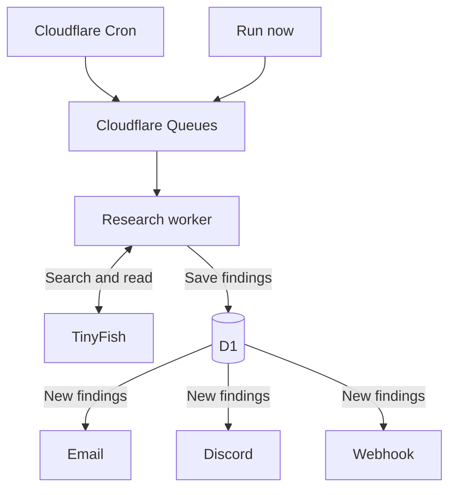

# Radar

Follow what matters without checking the same sites every day. Describe what you’re looking for, and Radar searches the web on a schedule, saves new findings with source links, and notifies you by email, Discord, or webhook when there’s something new.

**[Try Radar →](https://radar.fdemir.dev)**

## How it works

1. **Describe what to follow.** A product launch, a topic you’re researching, or news you want to keep up with.
2. **Choose a schedule.** Check hourly, daily, every three days, or weekly.
3. **Read what’s new.** Review findings and their sources, save useful results, and get email, Discord, or webhook updates.

You can edit, pause, or resume a task at any time. Connect Discord or verify your email in Settings to receive notifications.

To send findings to your own app or automation, add a webhook in Settings. See [webhook setup and payloads](docs/webhooks.md).

## Behind each check

Scheduled and manual checks enter Cloudflare Queues. A research worker uses AI SDK and TinyFish to search the web, read sources, and save new findings in D1. New findings trigger email, Discord, or webhook notifications.

## Run it yourself

Radar is built with React Router, Hono, and AI SDK, and runs on Cloudflare Workers and D1.

Local development requires Node.js 22.15+, pnpm 10, a TinyFish API key, and an OpenAI-compatible model provider for research. Email delivery uses Resend and is optional.

See [local setup](AGENTS_README.md#local-setup) for installation and configuration, or [deployment](AGENTS_README.md#cloudflare-deployment) to host your own instance.

For architecture, research limits, and development commands, see the [technical reference](AGENTS_README.md).
